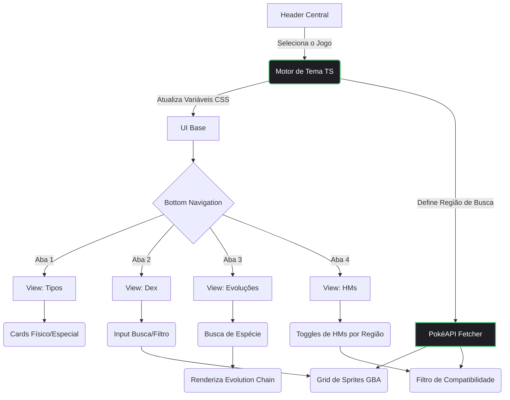

  
  
<strong>O companion app definitivo e minimalista para quem não lembra tanto assim das especificidades da 3ª Geração de Pokémon.</strong>

---

## A Ideia por Trás do Projeto

Quem joga a terceira geração de Pokémon (Ruby, Sapphire, Emerald, FireRed e LeafGreen) no hardware original ou em emuladores conhece bem algumas dores de cabeça clássicas:
1. **A Divisão Physical/Special:** Na Gen 3, o dano físico ou especial é atrelado ao Tipo do Pokémon, e não ao ataque em si. Decorar isso é um pesadelo.
2. **Consultas Lentas:** Parar o jogo para abrir wikis poluídas e pesadas no celular quebra totalmente o ritmo da gameplay.

O gen3.KIT nasceu para resolver isso. É um PWA (Progressive Web App) mobile-first, desenhado com foco absoluto em usabilidade, performance e estética. Sem frameworks pesados, construído apenas com TypeScript, HTML e CSS puro. O app muda de tema e dados dinamicamente de acordo com o cartucho que você seleciona, oferecendo exatamente a informação que você precisa, na hora que você precisa.

## Funcionalidades

- **Temas Dinâmicos:** A paleta de cores e a animação de fundo do app se adaptam instantaneamente ao jogo selecionado no Header (ex: verde esmeralda para Emerald, vermelho fogo para FireRed).
- **Referência Rápida de Tipagem:** Tela inicial focada em tirar a dúvida crucial da Gen 3: quais tipos batem Physical e quais batem Special.
- **Pokédex Regional Integrada:** Motor de busca em tempo real consumindo a PokéAPI. Filtra os Pokémon disponíveis no jogo selecionado, exibindo exclusivamente os sprites originais do Game Boy Advance.
- **Rastreador de Evoluções:** Parser complexo da árvore de evoluções (evolution-chain) para detalhar se o Pokémon evolui por Level, Pedra, Troca ou Felicidade.

## Arquitetura e Fluxo de Navegação

O app funciona como uma Single Page Application (SPA) controlada via TypeScript, garantindo transições instantâneas entre as visualizações sem recarregar a página.

## Tecnologias Utilizadas

- **HTML5 & CSS3:** Estrutura semântica e estilização avançada (Flexbox, CSS Grid, Variáveis CSS, Backdrop-filter para Glassmorphism, Safe-area-inset para iOS).
- **TypeScript:** Lógica de navegação SPA, gerenciamento de estado do tema e requisições assíncronas.
- **PokéAPI:** Consumo de dados RESTful (/pokedex/, /pokemon-species/, /evolution-chain/).
- **PWA (Progressive Web App):** Manifesto e configurações de cache para instalação direta na tela inicial de smartphones.
